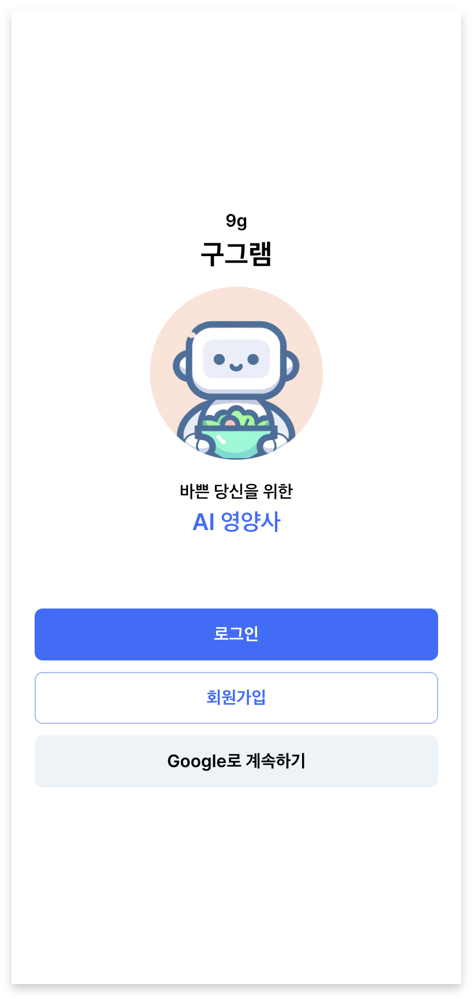
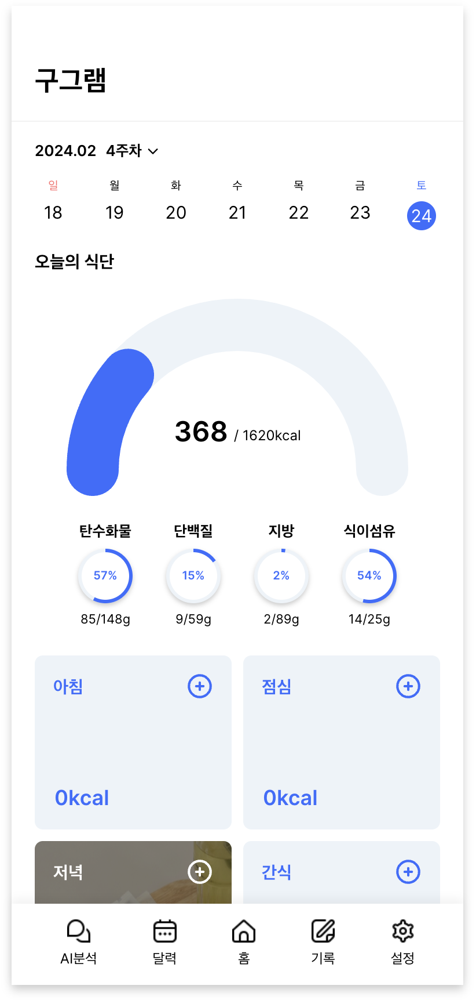
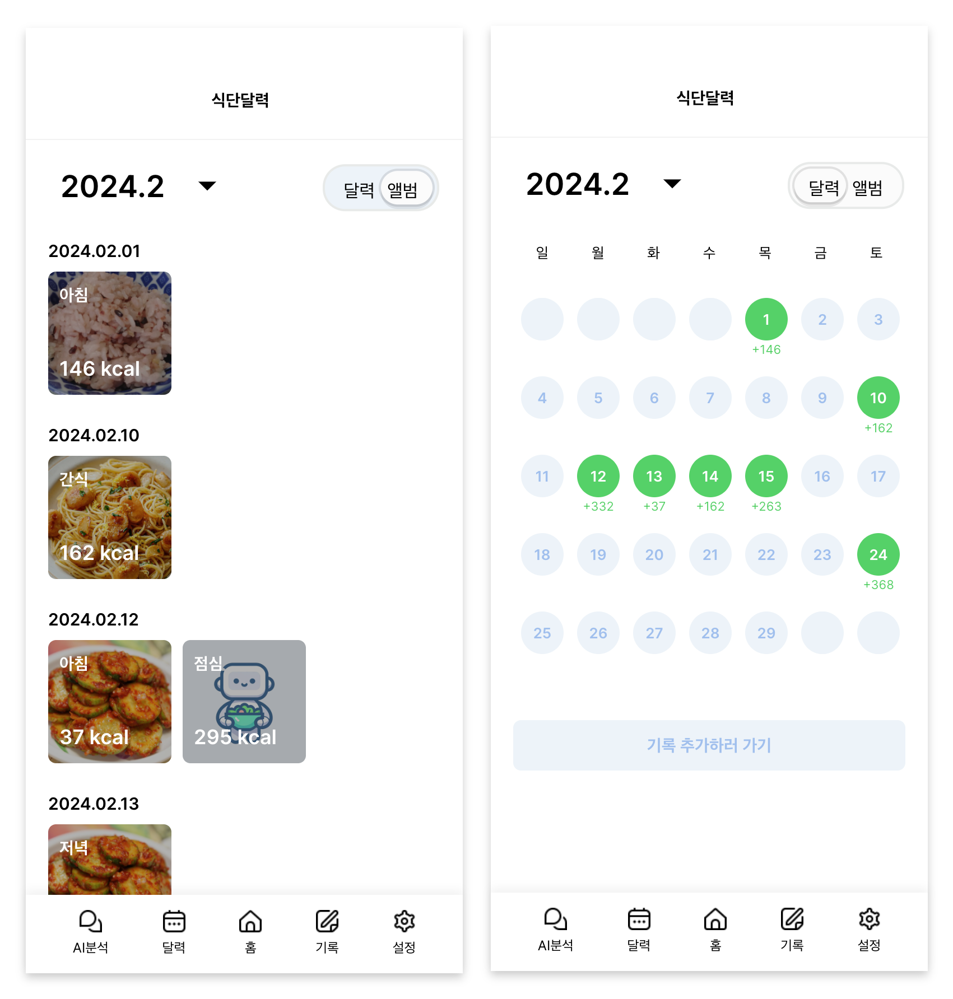
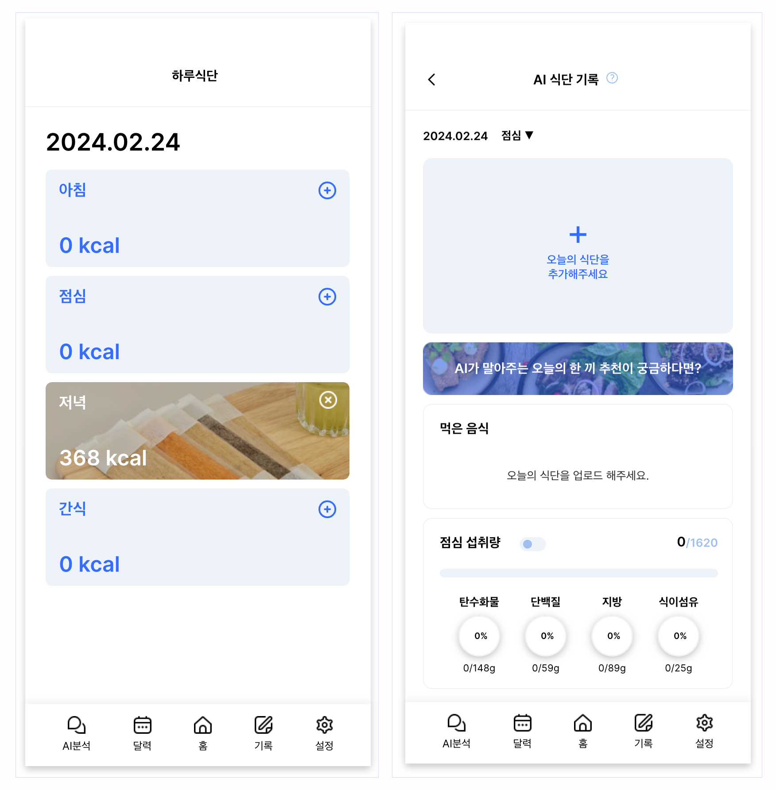
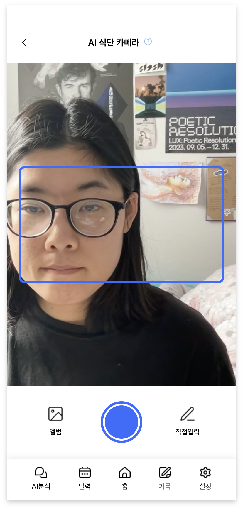
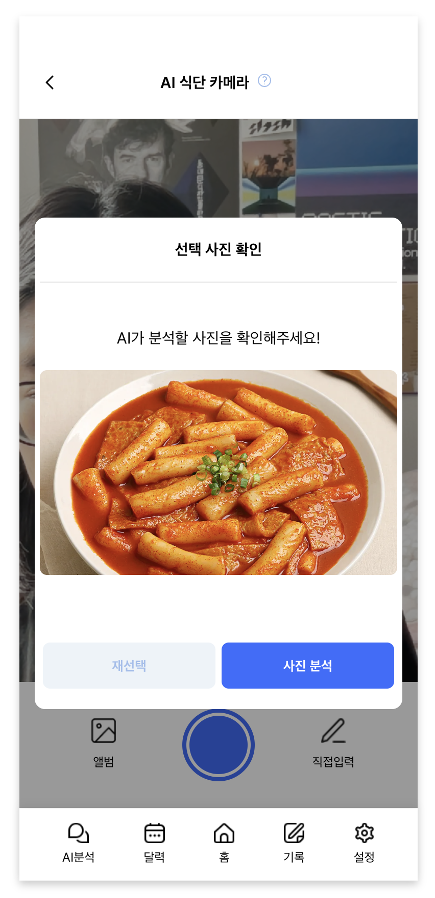
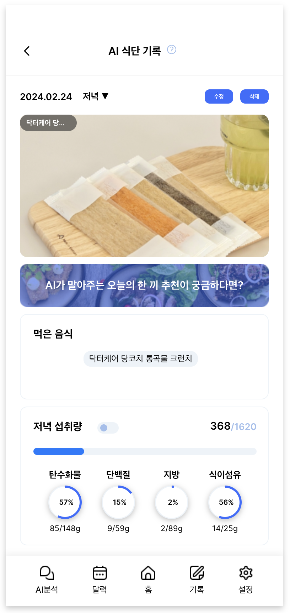

# Gugram: 이미지 처리 인공지능을 활용한 식단기록 서비스

### **목차**<br/>
[1. 프로젝트 소개](#1-프로젝트-소개)<br/>
[2. 프로젝트 사용 도구와 데이터](#2-프로젝트-사용-도구와-데이터)<br/>
[3. 프로젝트 기능 소개 ](#3-프로젝트-기능-설명)<br/>
[4. 프로젝트 팀원 역할 분담](#4-프로젝트-팀원-역할-분담)<br/>
[5. 버전](#5-버전)<br/>

<br />

## 1. 프로젝트 소개
### **Gugram**<br/>
### 구그램은 이미지 처리 인공지능을 활용한 식단기록 서비스

| 차별화 기능 1 | 이미지 처리 모델로 사진속 음식의 이름을 추론하여 그 결과를 기록 |
| ------ | ------ |
| 차별화 기능 2 | OPEN AI API를 활용하여 사용자의 식단 데이터를 바탕으로 식단 분석을 Chat GPT4.0에 요청 |

<br />

## 2. 프로젝트 사용 도구와 데이터
### 사용 도구 및 데이터 <br/>
 - AI <br/>
 
 

 - Front-end <br/>
                
 
 - Back-end <br/>
       

- Deploy <br/>
 
 

- Datas <br /> 음식 이미지 및 영양정보 텍스트 : https://www.aihub.or.kr/aihubdata/data/view.do?currMenu=&topMenu=&aihubDataSe=data&dataSetSn=74 <br />--> 이미지 처리 모델 학습에 사용 <br/><br/>식품의약품안전처 식품영양성분 API : https://various.foodsafetykorea.go.kr/nutrient/ <br /> --> 음식 영양성분 데이터로 사용 </br></br>

<br />

## 2. 프로젝트 기능 설명

<table>
<colgroup>
    <col style="width: 20%;">
    <col style="width: 20%;">
    <col style="width: 40%;">
  </colgroup>
  <thead>
    <tr>
      <th>1. 회원가입 & 로그인 페이지</th>
      <th>2. 메인페이지</th>
      <th>3. 식단 조회 페이지: 달력형 & 앨범형</th>
    </tr>
  </thead>
  <tbody>
    <tr  style="font-size:12px">
      <td>- 로컬로그인과 구글로그인으로 서비스를 이용할 수 있습니다.</td>
      <td>- 홈 화면에서는 하루섭취 정보를 볼 수 있습니다.</td>
      <td>- 달력에서는 일일목표섭취 칼로리 달성여부를 한눈에 볼 수 있습니다. <br /> - 앨범페이지에서는 섭취한 식단들의 사진을 모아 볼 수 있습니다.</td>
    </tr>
    <tr>
      <td></td>
      <td></td>
      <td></td>
    </tr>
  </tbody>
</table>

<table>
  <colgroup>
    <col style="width: 40%;">
    <col style="width: 20%;">
    <col style="width: 20%;">
    <col style="width: 20%;">
  </colgroup>
  <thead>
    <tr>
      <th>4. 식단 기록 페이지</th>
      <th></th>
      <th></th>
      <th></th>
    </tr>
  </thead>
  <tbody>
    <tr style="font-size:12px">
      <td>- 아침,점심,저녁,간식을 선택하여 기록할 수 있습니다.</td>
      <td>- "촬영 기능"과 "사진업로드 기능" 또는 "집접입력 기능"으로 음식 사진을 업로드 할 수 있습니다.</td>
      <td>- 사진 업로드 후 AI서버에 사진 분석이 요청됩니다.<br/> - 분석이 끝난 뒤에 분석결과를 선택하여 수정할 수 있습니다.</td>
      <td >- 수정을 마치면, 식단 기록이 완료됩니다.</td>
    </tr>
    <tr>
      <td>  
      <td></td>
      <td></td>
      <td></td>
    </tr>
  </tbody>
</table>


**5. 한끼 식단 페이지**<br/>
- 음식 이미지 등록 기능 ( 촬영 또는 앨범 )
    - 등록된 음식 이미지를 분석하여 얻은 음식 종류 데이터 제공
    - 여러 음식이 보이는 사진을 등록하면, 이를 분석하여 개별 음식 사진으로 등록
    - 분석된 음식명을 원본 이미지 위에 태그로 표시 </br></br>
- 음식명 검색 및 등록 기능 (사진 없음)
    - 식품의약품안전처 식품영양성분 데이터베이스 활용
- 음식 종류 별 칼로리와 영양성분 데이터 제공
  - 식품의약품안전처 식품영양성분 데이터베이스 활용

**6. AI영양사 페이지**<br/>
- 채팅형 레이아웃
- open ai api를 활용한 사용자 맞춤 식단 분석 데이터 제공 및 저장
  - 식단 추천
  - 선택한 식단 평가
  - 목표 추천 <br/><br/>


### 프로젝트만의 차별점, 기대 효과
- AI를 활용한 음식 이미지 인식
- Open AI API를 이용한 사용자 맞춤 식단 분석 서비스 제공


## 4. 프로젝트 구성도
### 메인페이지
### 회원가입 & 로그인 & 프로필
### 습관페이지
### 캘린더 / 커뮤니티


## 5. 프로젝트 팀원 역할 분담
| 이름 | 담당 업무 |
| ------ | ------ |
| 허제인 | 팀장/프론트엔드 개발 |
| 배현진 | 프론트엔드 개발/AI 개발 |
| 양민정 | 프론트엔드 개발 |
| 오혜수 | 프론트엔드 개발 |
| 정아영 | 프론트엔드 |
| 김명지 | 백엔드 개발 |
| 장재웅 | 백엔드 개발 |
| 최유림 | 백엔드 개발 |
| 차봉준 | AI 개발 |

**멤버별 responsibility**

1. 팀장 

- 기획 단계: 구체적인 설계와 지표에 따른 프로젝트 제안서 작성
- 개발 단계: 팀원간의 일정 등 조율 + 프론트 개발
- 수정 단계: 기획, 스크럼 진행, 코치님 피드백 반영해서 수정

2. 프론트엔드 

- 기획 단계: 큰 주제에서 문제 해결 아이디어 도출, 데이터 수집, 와이어프레임 작성
- 개발 단계: 와이어프레임을 기반으로 구현, 데이터 처리 및 시각화 담당, UI 디자인 완성
- 수정 단계: 피드백 반영해서 프론트 디자인 수정

 3. 백엔드 & 데이터 담당  

- 기획 단계: 기획 데이터 분석을 통해 해결하고자 하는 문제를 정의
- 개발 단계: 웹 서버 사용자가 직접 백엔드에 저장할수 있는 기능 구현, 데이터 베이스 구축 및 API 활용, 데이터 분석 개념 총동원하기
- 수정 단계: 코치님 피드백 반영해서 분석 / 시각화 방식 수정<br/>

## 6. 버전
  - 0.0.1


<img src="ht## 백엔드 실행 방법
```shell 
cd src
npm run start:dev
```
---

## swagger 접속방법
블라우저에 http://localhost:5001/api-docs 입력

---

## docker 사용방법
1. docker 설치하기 [docker 공식페이지](https://www.docker.com/products/docker-desktop/)
2. 레포지토리의 루트 디렉토리에서 아래 명령어 실행하여 아미지 빌드
```
docker build -t ggu_back .
```
3. 생성된 이미지 확인
```
docker images
```
4. 이미지로 컨텐이너 띄우기
```
docker run -d -p 3002:5002 ggu_back
```
5. 컨테이너 동작 확인
```
docker ps
```
6. 브라우저에서 아래 주소 입력해보기
```
http://127.0.0.1:3002
```


---
