# Gugram: 이미지 처리 인공지능을 활용한 식단기록 서비스

### **목차** 
[1. 프로젝트 소개](#1-프로젝트-소개) 
[2. 프로젝트 사용 도구와 데이터](#2-프로젝트-사용-도구와-데이터) 
[3. 프로젝트 기능 소개 ](#3-프로젝트-기능-설명) 
[4. 프로젝트 팀원 역할 분담](#4-프로젝트-팀원-역할-분담) 
[5. 버전](#5-버전) 

 

## 1. 프로젝트 소개
### **Gugram** 
### 구그램은 이미지 처리 인공지능을 활용한 식단기록 서비스

| 차별화 기능 1 | 이미지 처리 모델로 사진속 음식의 이름을 추론하여 그 결과를 기록 |
| ------ | ------ |
| 차별화 기능 2 | OPEN AI API를 활용하여 사용자의 식단 데이터를 바탕으로 식단 분석을 Chat GPT4.0에 요청 |

 

## 2. 프로젝트 사용 도구와 데이터
### 사용 도구 및 데이터  
 - AI  
 
 

 - Front-end  
                
 
 - Back-end  
       

- Deploy  
  

- Datas   음식 이미지 및 영양정보 텍스트 : https://www.aihub.or.kr/aihubdata/data/view.do?currMenu=&topMenu=&aihubDataSe=data&dataSetSn=74  --> 이미지 처리 모델 학습에 사용   식품의약품안전처 식품영양성분 API : https://various.foodsafetykorea.go.kr/nutrient/   --> 음식 영양성분 데이터로 사용   

 

## 3. 프로젝트 기능 설명

<table>
  <thead>
    <tr>
      <th>1. 회원가입 & 로그인 페이지</th>
      <th>2. 메인페이지</th>
    </tr>
  </thead>
  <tbody>
    <tr  style="font-size:12px">
      <td>로컬로그인과 구글로그인으로 서비스를 이용할 수 있습니다.</td>
      <td>홈 화면에서는 하루섭취 정보를 볼 수 있습니다.</td>
    </tr>
    <tr>
      <td>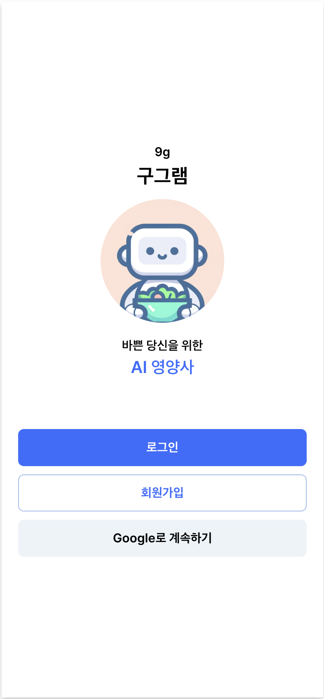</td>
      <td>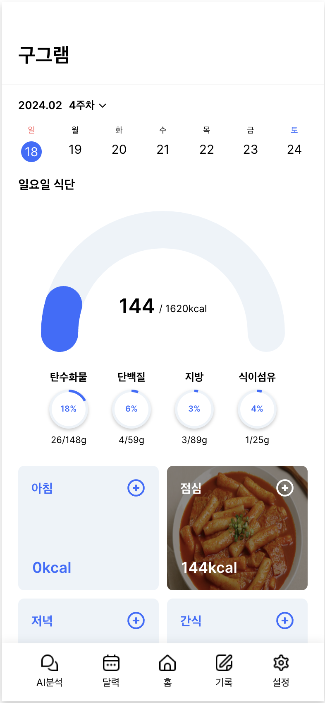</td>
    </tr>
  </tbody>
</table>

<table>
  <thead>
    <tr>
      <th>3. 식단 조회 페이지: 달력형</th>
      <th>3. 식단 조회 페이지: 앨범형</th>
    </tr>
  </thead>
  <tbody>
    <tr  style="font-size:12px">
      <td> 달력에서는 일일목표섭취 칼로리 달성여부를 한눈에 볼 수 있습니다. </td>
      <td> 앨범페이지에서는 섭취한 식단들의 사진을 모아 볼 수 있습니다.</td>
    </tr>
    <tr>
      <td>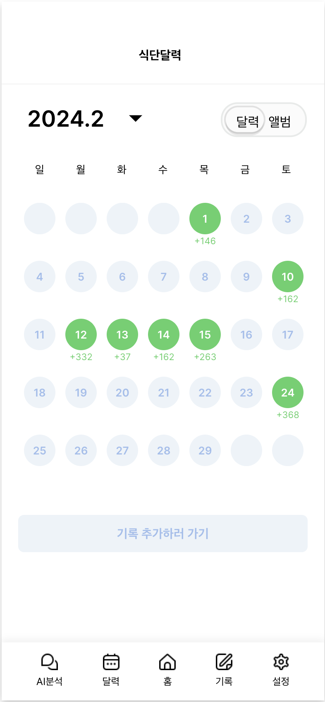</td>
      <td>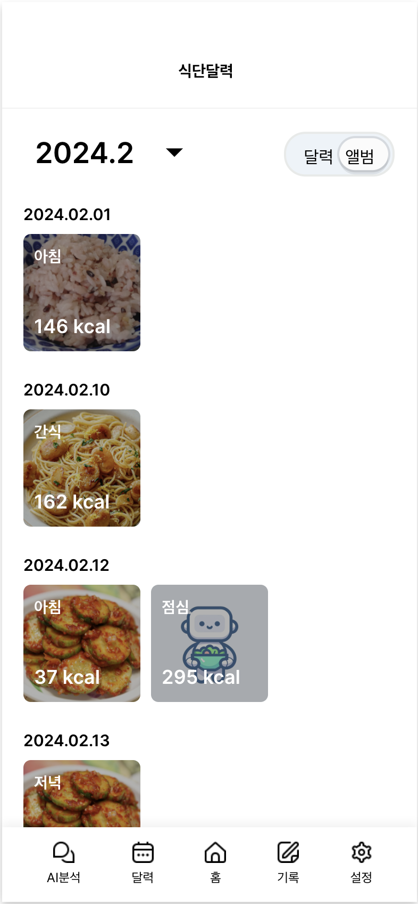</td>
    </tr>
  </tbody>
</table>

<table>
  <thead>
    <tr>
      <th>4. 식단 기록 페이지</th>
      <th></th>
      <th></th>
      <th></th>
    </tr>
  </thead>
  <tbody>
    <tr style="font-size:12px">
      <td>아침,점심,저녁,간식을 선택하여 기록할 수 있습니다.</td>
      <td>아침,점심,저녁,간식 중 택1하면 기록페이지로 넘어갑니다.</td>
      <td>"촬영 기능" 으로 음식 사진을 업로드 할 수 있습니다.</td>
      <td>"이미지 업로드 기능" 으로 음식 사진을 업로드 할 수 있습니다.</td>
    </tr>
    <tr>
      <td> 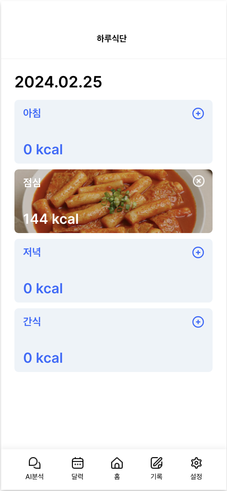 </td>
      <td>  </td>
      <td>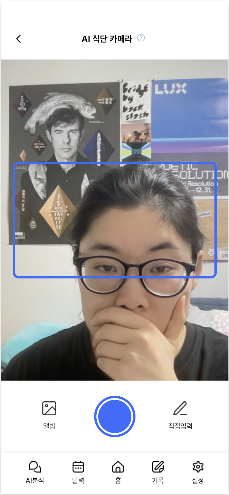</td>
      <td>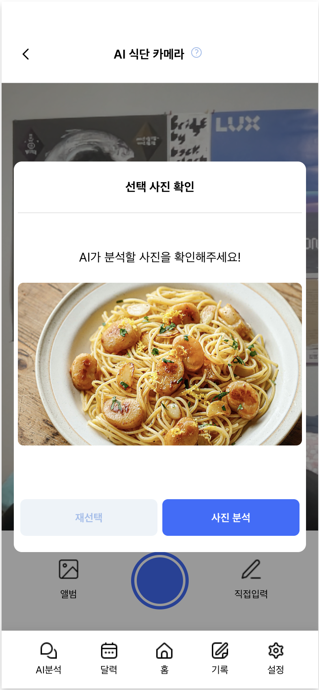</td>
    </tr>
    <tr style="font-size:12px">
      <td>사진 업로드 후 분석요청시 AI서버에 사진 분석이 요청됩니다.</td>
      <td>분석이 끝난 뒤에 분석결과가 나타납니다.</td>
      <td>분석이 끝난 뒤에 분석결과를 선택하여 수정할 수 있습니다.</td>
      <td>수정을 마치면, 식단 기록이 완료됩니다.</td>
    </tr>
    <tr>
      <td>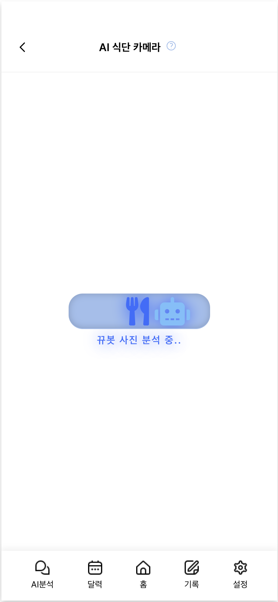</td>
      <td>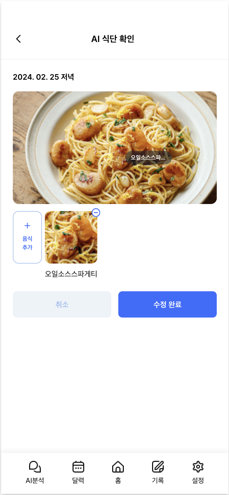</td>
      <td>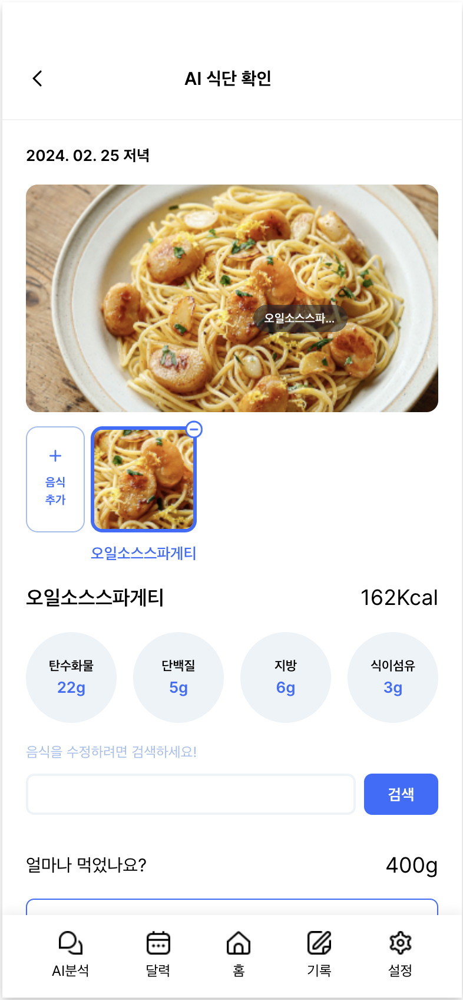</td>
      <td>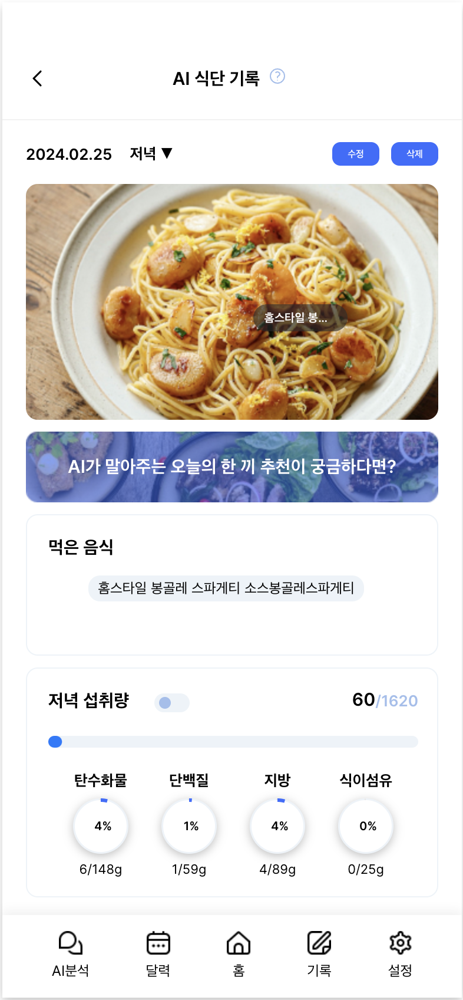</td>
    </tr>
  </tbody>
</table>

<table>
  <thead>
    <tr>
      <th>5. AI영양사 페이지</th>
      <th>6. 개인정보 페이지</th>
    </tr>
  </thead>
  <tbody>
    <tr style="font-size:12px">
      <td>OPEN AI API를 사용하여 chat gpt에게 식단분석을 요청할 수 있습니다.</td>
      <td>개인 건강정보를 수정할 수 있습니다.</td>
    </tr>
    <tr>
      <td> 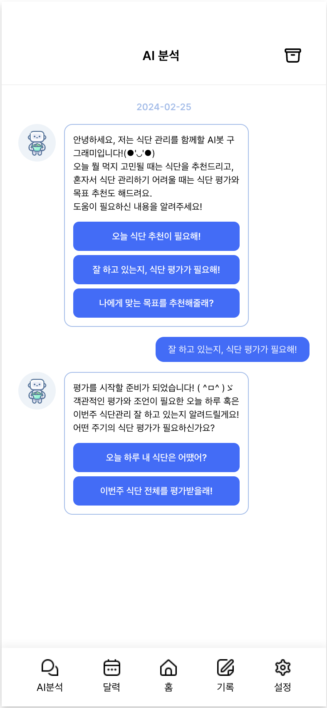 </td>
      <td> 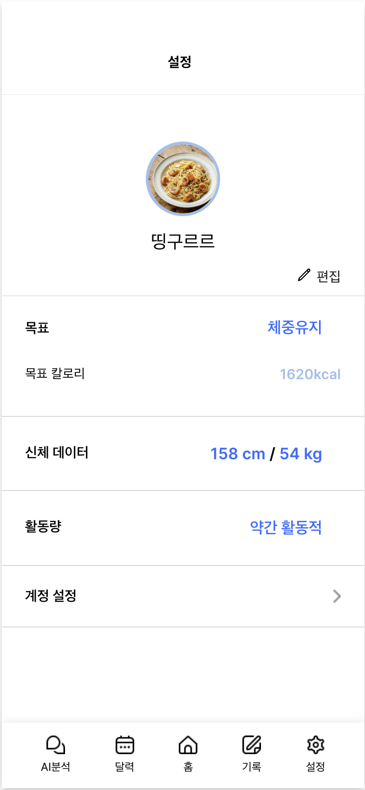 </td>
    </tr>
  </tbody>
</table>

## 4. 프로젝트 팀원 역할 분담
| 이름 | 담당 업무 | 상세 기능 |
| ------ | ------ | ------ |
| 허제인 | 팀장/프론트엔드 개발 | 식단조회페이지 구현 / 달력 컴포넌트 제작 / API컴포넌트 구현 |
| 배현진 | 프론트엔드 개발/AI 개발 | 개인정보페이지 구현 / 로그아웃 기능 구현 / 로그인페이지 구현 |
| 양민정 | 프론트엔드 개발 | 식단기록페이지 구현 / 촬영기능 구현 / 이미지업로드기능 구현 |
| 오혜수 | 프론트엔드 개발 | 회원가입페이지 구현 |
| 정아영 | 프론트엔드 | AI영양사페이지 구현 / 식단조회페이지 구현 |
| 김명지 | 백엔드 개발 | 로컬 & 구글로그인 구현 / users_MVP API 작성 / image_MVP API작성 / RDS생성및 연결 / S3생성및 연결 / HTTPS 구현 / VM에 배포 |
| 장재웅 | 백엔드 개발 | record_MVP API 작성 |
| 최유림 | 백엔드 개발 | OPEN AI API 연동 / 식품데이터API 연동 / cumulative_record_MVP API 작성 / food_info_MVP API 작성 |
| 차봉준 | AI 개발 | ultralytics를 활용하여 음식 인식 이미지 모델 학습|

## 5. 버전
  - 0.0.1

